# Developer Guide

## Acknowledgements

- Core project structure and development workflow were adapted from the NUS CS2113T Duke project conventions.
- Unit testing is implemented with [JUnit 5](https://junit.org/junit5/).
- Diagrams are authored using [PlantUML](https://plantuml.com/).
- Java APIs used in this project are from the [Java SE 17 documentation](https://docs.oracle.com/en/java/javase/17/docs/api/).

## Design & Implementation

This section describes the architecture and the main implementation flows in ResuMake.

### High-level Architecture

ResuMake is a command-driven CLI application with four core runtime components:

- `Resumake`: Main application loop and orchestration.
- `Ui`: Input/output boundary with the terminal.
- `Parser`: Converts raw user input into concrete `Command` objects.
- `Storage`: Loads and persists user profile + records in `records.txt`.

At runtime, the flow is:

1. `Resumake` loads persisted data through `Storage`.
2. `Ui` reads user commands.
3. `Parser` maps command text to a `Command` subclass.
4. Command execution mutates or queries `RecordList`.
5. `Storage` persists the latest state (writes only when serialized content differs).

### Architecture Class Diagram

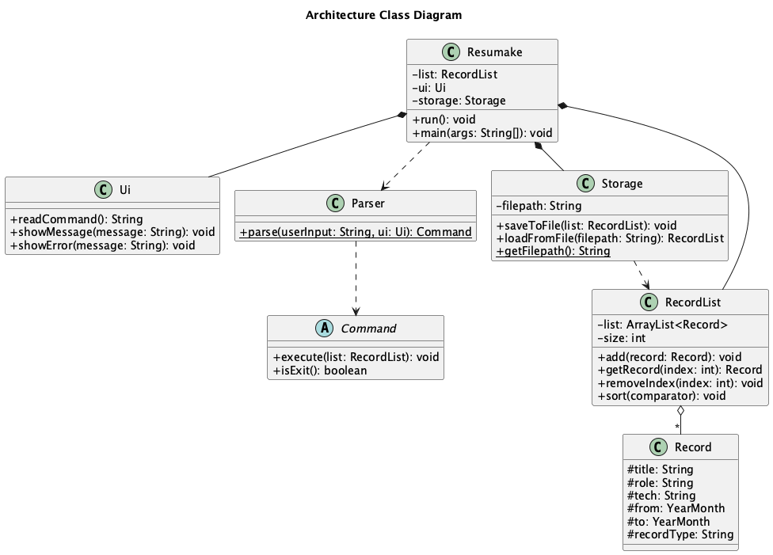

The architecture centers around `Resumake`, which coordinates `Ui`, `Parser`, `Storage`, and `RecordList`.
`Parser` maps input into `Command` objects, and `Storage` persists `RecordList` data.

### Record Hierarchy Class Diagram

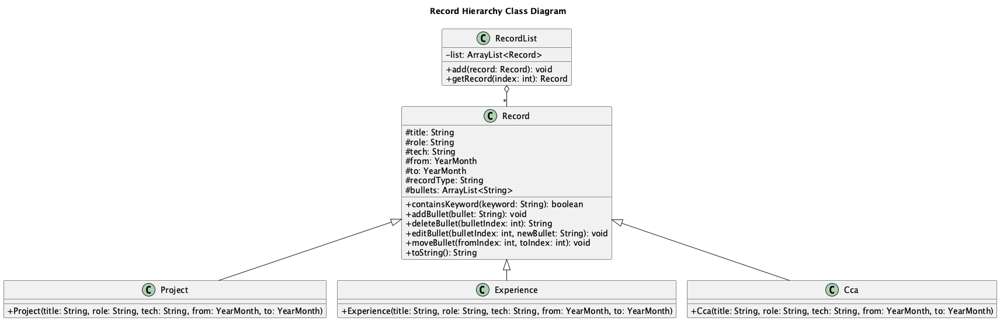

`Record` is the base abstraction for resume entries and is extended by `Project`, `Experience`, and `Cca`.
Bullets are managed inside `Record`, while `RecordList` provides collection-level operations.

### Delete and Storage Class Diagram

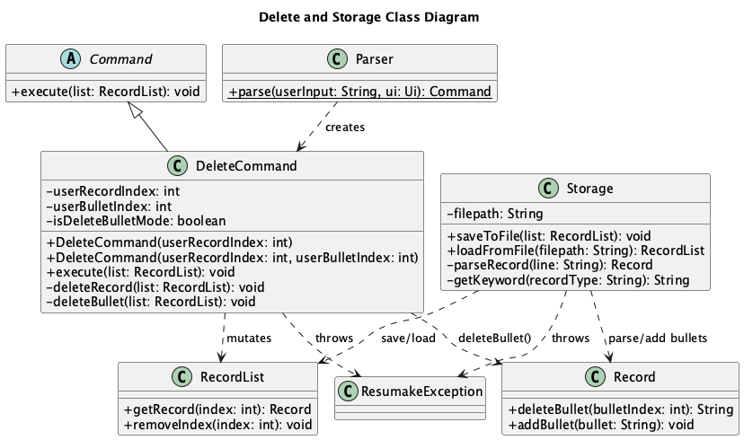

This feature area includes:

- `Parser` creating `DeleteCommand` for `delete` and `deletebullet`.
- `DeleteCommand` mutating `RecordList` (record deletion) or `Record` (bullet deletion).
- `Storage` handling persistence via `saveToFile` and `loadFromFile`.

### Command Hierarchy Class Diagram

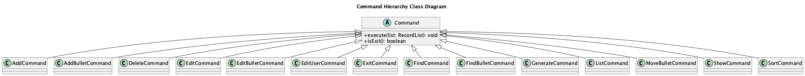

This diagram shows all concrete command classes that extend the `Command` base class.
It summarizes the command-oriented architecture used by `Parser`.

### Bullet and Edit Feature Class Diagram

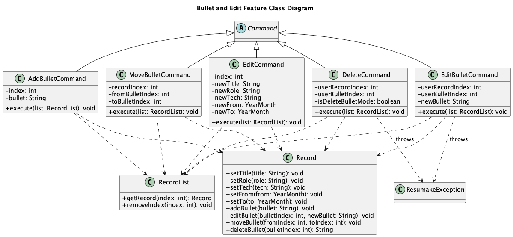

This diagram captures editing-related commands:

- `AddBulletCommand`
- `EditBulletCommand`
- `MoveBulletCommand`
- `EditCommand`
- `DeleteCommand`

It also shows how these commands interact with `RecordList`, `Record`, and `ResumakeException`.

### User and Exception Class Diagram

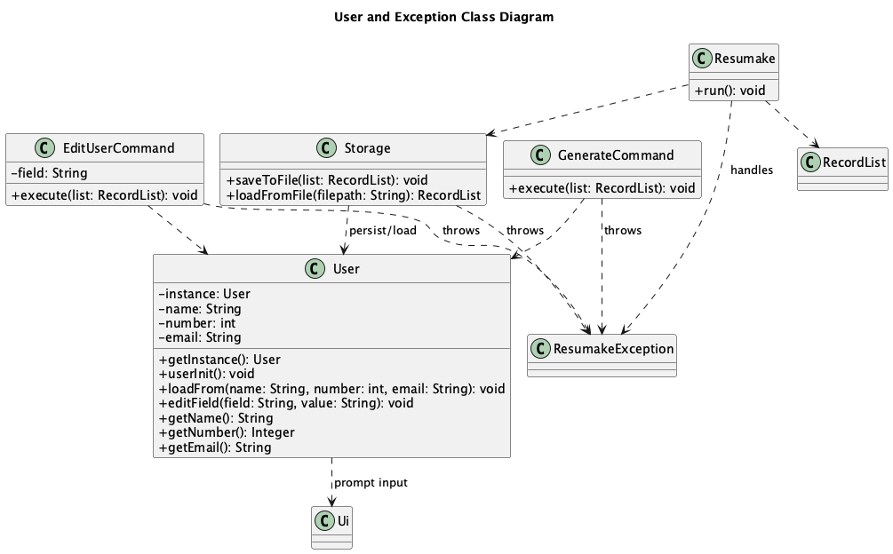

This diagram focuses on user profile and exception interactions across `User`,
`EditUserCommand`, `GenerateCommand`, `Storage`, and `Resumake`.

### Diagram Sources

Class diagram sources:

- `docs/diagrams/ArchitectureClassDiagram.puml`
- `docs/diagrams/FullSystemClassDiagram.puml` (all production classes)
- `docs/diagrams/RecordHierarchyClassDiagram.puml`
- `docs/diagrams/DeleteStorageClassDiagram.puml`
- `docs/diagrams/CommandHierarchyClassDiagram.puml`
- `docs/diagrams/BulletAndEditClassDiagram.puml`
- `docs/diagrams/UserAndExceptionClassDiagram.puml`

### Full System Class Diagram

For complete class-level coverage across all classes in `src/main/java`, use:

- `docs/diagrams/FullSystemClassDiagram.puml`

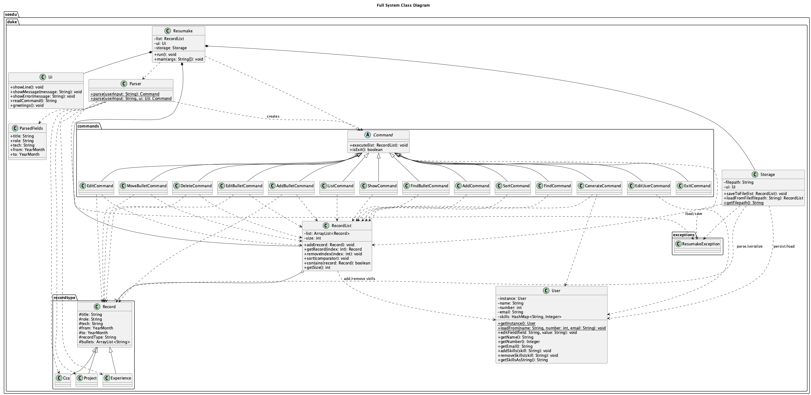

## Implementation Details

### Command Parsing and Dispatch

`Parser.parse(...)` performs a keyword-based dispatch:

- Splits user input into command word + argument segment.
- Validates command-specific formats.
- Constructs a concrete `Command` object (for example, `AddCommand`, `DeleteCommand`, `EditCommand`).
- Throws `ResumakeException` for invalid formats, which `Resumake` catches and displays via `Ui`.

This keeps parsing and execution concerns separated.

### Storage Format and Persistence

ResuMake stores data in a flat text file (`records.txt`) with:

- First line reserved for user profile: `USER|name|number|email`
- Subsequent lines for records in command-like format, e.g.
  `project Title /role Role /tech Tech /from 2026-01 /to 2026-03 /bullets bullet A ;; bullet B`

Key behaviors:

- `loadFromFile` creates the directory/file if missing.
- Invalid record lines are skipped instead of crashing load.
- User line parsing uses `split("\\|", 4)` to preserve the full email field if delimiters appear inside the email text.
- `saveToFile` serializes all in-memory data and compares against existing file content.
- If content is unchanged, file write and save confirmation message are skipped.

This design prevents misleading save confirmations for read-only commands while preserving the existing call flow in `Resumake`.

### Delete Feature

`DeleteCommand` supports two modes:

- Record deletion (`delete INDEX`)
- Bullet deletion (`deletebullet RECORD_INDEX BULLET_INDEX`)

Design choices:

- User-facing indices are 1-based.
- Internally, indices are normalized to 0-based before list access.
- Out-of-range access throws `ResumakeException` with a clear message.

### Bullet Editing Feature

The bullet-editing flow is split into focused commands:

- `AddBulletCommand`: Adds a non-empty, non-duplicate bullet.
- `EditBulletCommand`: Replaces bullet text at a valid index.
- `MoveBulletCommand`: Reorders bullets within the same record.

Validation is enforced in both command and `Record` layers to keep data consistent.

### Add, Edit, and Duplicate-Protection Features

Record creation commands (`project`, `experience`, `cca`) are parsed in `Parser` and instantiated as
`Project`, `Experience`, or `Cca`, then executed through `AddCommand`.

Important behavior:

- `AddCommand` rejects duplicate records using `RecordList.contains(...)`.
- `edit` uses `EditCommand` for partial field updates (`title`, `role`, `tech`, `from`, `to`).
- Date constraints are validated to prevent `to < from`.

### View and Search Features

Read-style commands are implemented as:

- `list` via `ListCommand` (supports `all`, `E`, `C`, `P` filtering),
- `show` via `ShowCommand` (record + bullets),
- `find` via `FindCommand` (record field keyword search),
- `findbullet` via `FindBulletCommand` (bullet-only keyword search).

These commands do not mutate `RecordList`; storage now compares serialized state and skips file writes if unchanged.

### Sorting and Resume Generation Features

- `sort` is implemented by `SortCommand`, which delegates ordering to `RecordList.sort(...)`
  with a case-insensitive title comparator.
- `generate` is implemented by `GenerateCommand`, which prints:
  - current `User` details,
  - records grouped by type (`Cca`, `Experience`, `Project`),
  - skills summary from `User.getSkillsAsString()`.

### User Profile and Exit Features

- `edituser` is implemented by `EditUserCommand` and `User.editField(...)`, supporting `name`, `number`, and `email`.
- `bye` is implemented by `ExitCommand`; `Resumake` terminates the loop when `isExit()` returns `true`.
- User data lifecycle:
  - loaded from storage first line (`USER|...`) when available,
  - otherwise initialized interactively via `User.getInstance()`.

## Sequence Diagrams

This section provides full sequence coverage for runtime orchestration and every command family.

### Startup and Load

Source: `docs/diagrams/StartupLoadSequenceDiagram.puml`

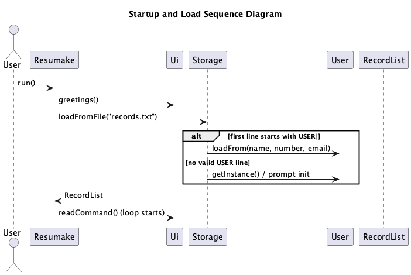

### Generic Command Dispatch

Source: `docs/diagrams/CommandDispatchSequenceDiagram.puml`

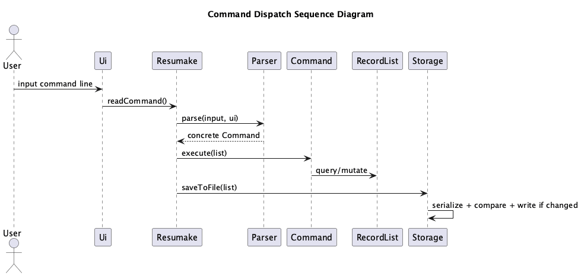

### Read-only Save Skip

Source: `docs/diagrams/ReadOnlySaveSkipSequenceDiagram.puml`

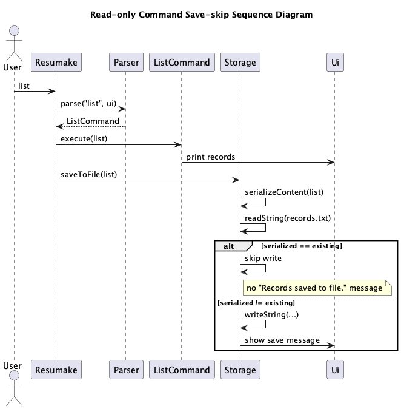

### Add Record (`project` / `experience` / `cca`)

Source: `docs/diagrams/AddRecordSequenceDiagram.puml`

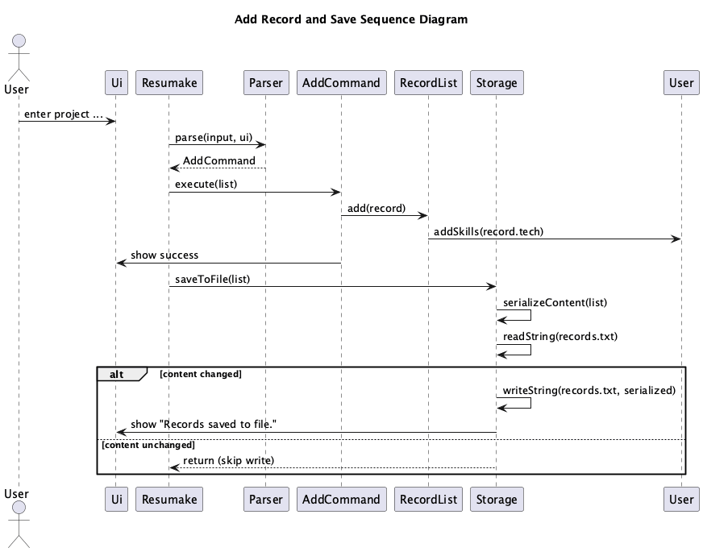

### Add Bullet (`addbullet`)

Source: `docs/diagrams/AddBulletSequenceDiagram.puml`

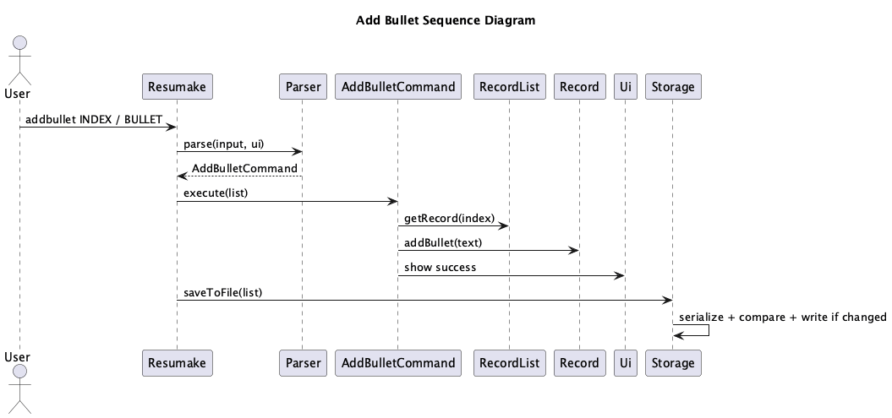

### Edit Record (`edit`)

Source: `docs/diagrams/EditRecordSequenceDiagram.puml`

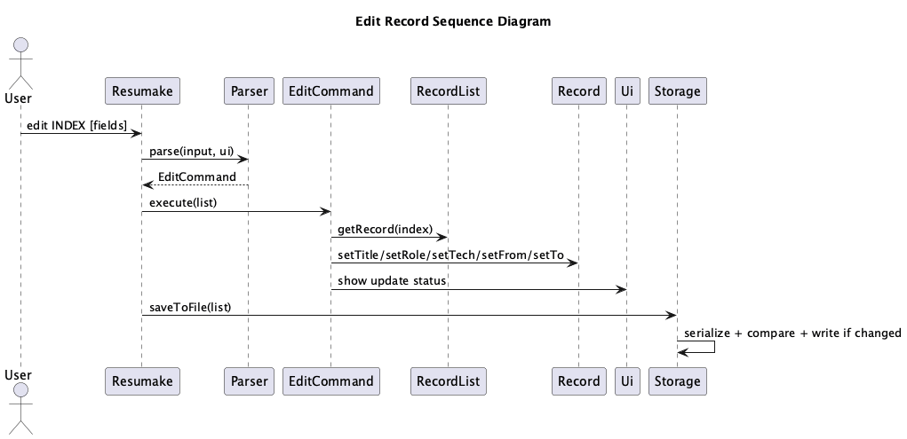

### Edit Bullet (`editbullet`)

Source: `docs/diagrams/EditBulletSequenceDiagram.puml`

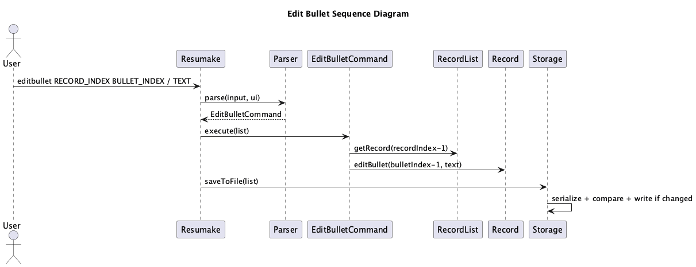

### Move Bullet (`movebullet`)

Source: `docs/diagrams/MoveBulletSequenceDiagram.puml`

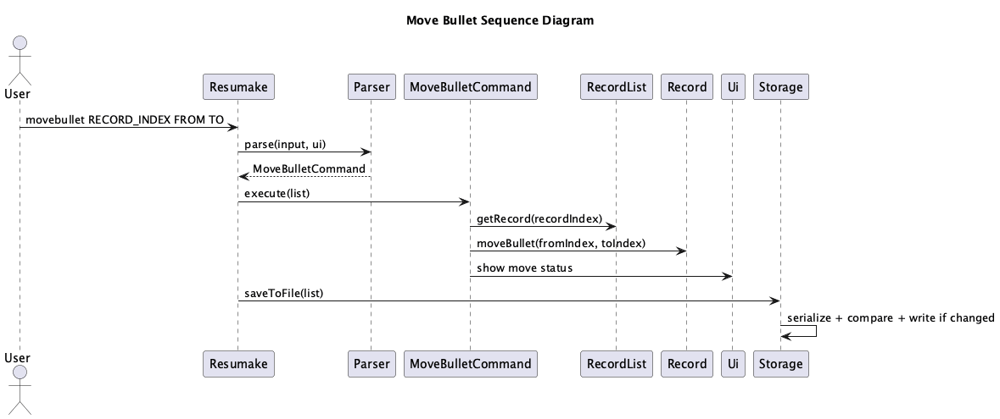

### Delete Record (`delete`)

Source: `docs/diagrams/DeleteRecordSequenceDiagram.puml`

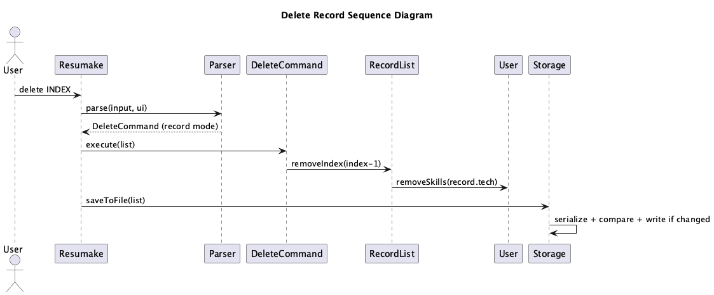

### Delete Bullet (`deletebullet`)

Source: `docs/diagrams/DeleteBulletSequenceDiagram.puml`

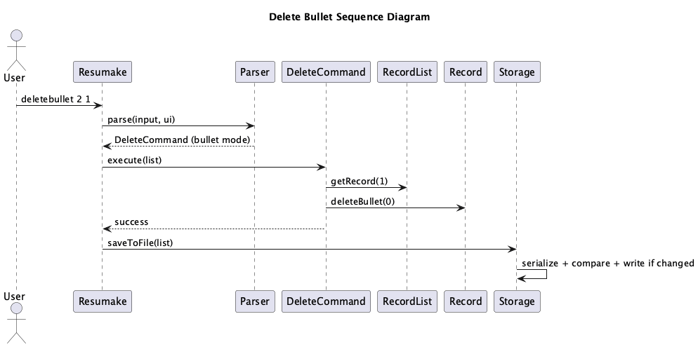

### List (`list`)

Source: `docs/diagrams/ListSequenceDiagram.puml`

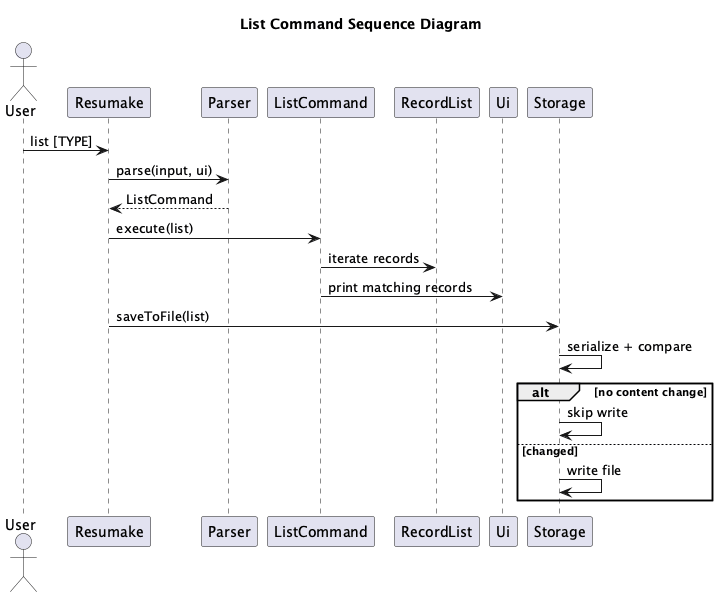

### Show (`show`)

Source: `docs/diagrams/ShowSequenceDiagram.puml`

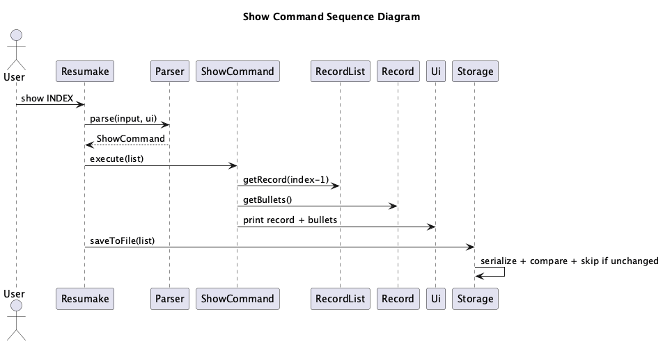

### Find (`find`)

Source: `docs/diagrams/FindSequenceDiagram.puml`

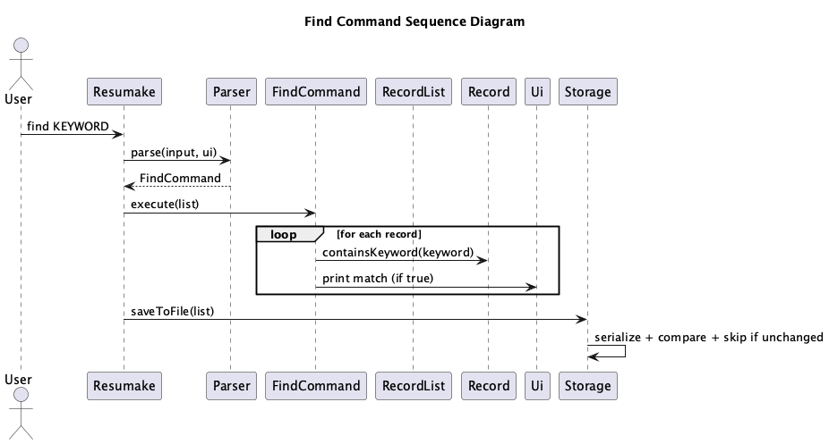

### Find Bullet (`findbullet`)

Source: `docs/diagrams/FindBulletSequenceDiagram.puml`

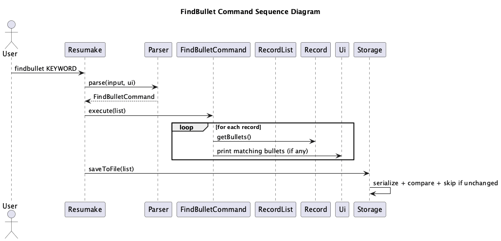

### Sort (`sort`)

Source: `docs/diagrams/SortSequenceDiagram.puml`

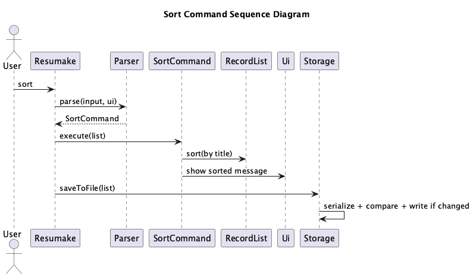

### Generate (`generate`)

Source: `docs/diagrams/GenerateSequenceDiagram.puml`

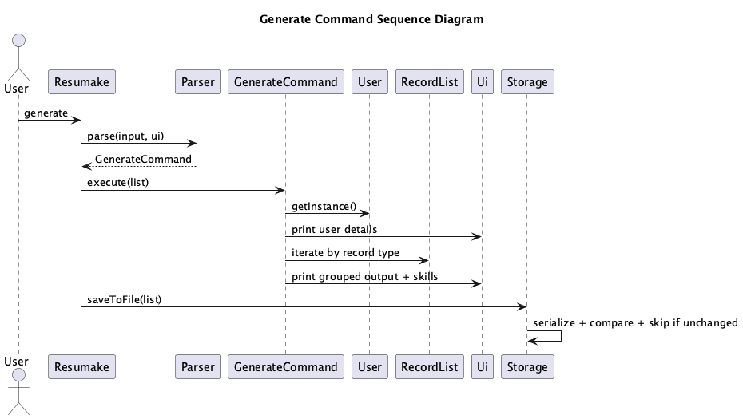

### Edit User (`edituser`)

Source: `docs/diagrams/EditUserSequenceDiagram.puml`

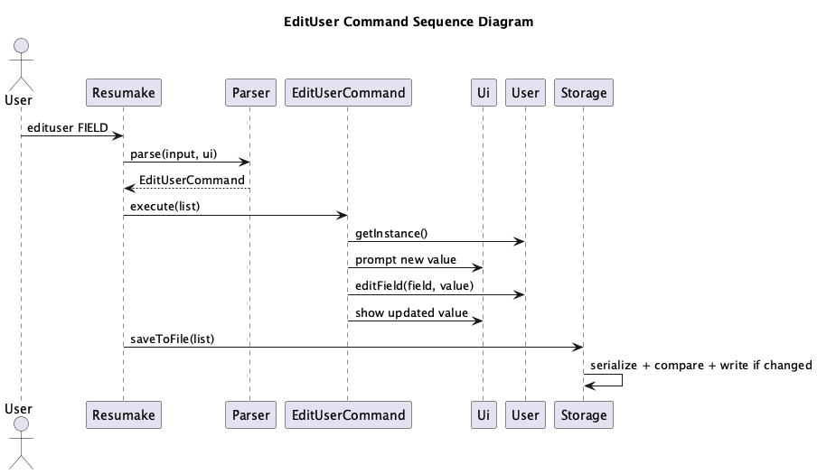

### Exit (`bye`)

Source: `docs/diagrams/ExitSequenceDiagram.puml`

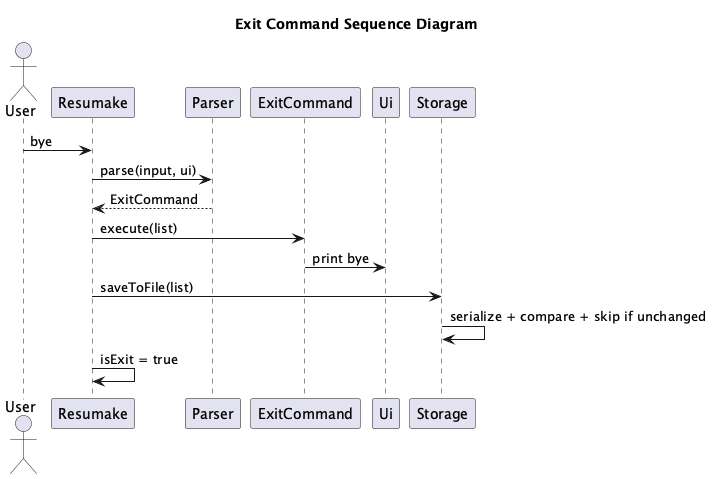

## Product Scope

### Target User Profile

ResuMake targets university students and early-career applicants preparing internship or full-time applications.

Typical users:

- Need to organize projects, experiences, and CCAs quickly.
- Prefer keyboard-first workflows over form-heavy GUI tools.
- Need to retrieve and refine resume bullets repeatedly over time.

### Value Proposition

ResuMake provides structured resume-content management in a lightweight CLI:

- Fast command-driven entry and editing.
- Consistent field structure (`title`, `role`, `tech`, date range, bullets).
- Persistent storage with automatic load/save behavior.
- Resume-style grouped output via `generate`.

## User Stories

| Version | As a ... | I want to ... | So that I can ... |
|--------|----------|---------------|----------------------------------------------------------------|
| v1.0 | student job applicant | add a new project with a title, role, and tech stack | start building resume content from my school and personal work |
| v1.0 | student job applicant | list all my saved projects | quickly review what I already have for applications |
| v1.0 | student job applicant | view one record with all bullets | check whether the information is complete and accurate |
| v1.0 | internship applicant | find records by keyword | quickly surface relevant entries for a specific role |
| v1.0 | fresh graduate | delete outdated or weak bullet points | keep only the most relevant content |
| v1.0 | fresh graduate | load saved data when the app starts | continue working without re-entering everything |
| v1.0 | user with many records | sort records by title | scan my content more quickly |
| v1.0 | applicant editing profile details | update name/number/email | keep generated resume output accurate |

## Non-Functional Requirements

1. Performance
- Typical command execution should complete within 1 second for normal workloads.
- Saving/loading should complete within 2 seconds for ~100 records.

2. Usability
- Command formats should remain consistent and predictable.
- Validation errors should be explicit and actionable.

3. Reliability
- Persisted data should survive restarts unless manually removed.
- Corrupted/invalid lines in storage should not crash startup.
- Save confirmation should reflect actual file changes.

4. Maintainability
- Architecture should remain command-oriented (`Parser` + `Command` subclasses).
- Logic should be separated by responsibility (`Storage`, `Parser`, `Ui`, `RecordList`).
- New commands should be addable without large cross-module edits.

5. Security and Safety
- User input is treated as data (never executed as code).
- Storage access is limited to local application files.

## Glossary

- **Record**: A single resume entry (`Project`, `Experience`, or `Cca`) with structured fields.
- **Bullet**: A resume point attached to a record.
- **RecordList**: In-memory collection that stores all records for the session.
- **User profile**: Singleton object containing user `name`, `number`, and `email`.
- **Mutating command**: A command that changes in-memory state (for example, `project`, `edit`, `delete`).
- **Read-only command**: A command that only displays/query data (for example, `list`, `show`, `find`).
- **Storage line**: One serialized text line in `records.txt` representing either user data or one record.

## Instructions for Manual Testing

### Setup

1. Ensure Java 17 is installed.
2. From project root, run:
   ```bash
   ./gradlew run
   ```
3. Use a clean test environment by removing `records.txt` before first run if needed.

### Seed Data (Optional)

Create `records.txt` with:

```text
USER|Alex Tan|98765432|alex@example.com
project Resume Builder /role Developer /tech Java /from 2026-01 /to 2026-03 /bullets Built parser ;; Added tests
experience Internship /role SWE Intern /tech Python /from 2025-05 /to 2025-08
cca Computing Club /role Member /tech Leadership /from 2024-01 /to 2024-12
```

Restart the app and verify records are loaded.

### Core Functional Tests

1. Add record
- Command: `project Portfolio Site /role Developer /tech React /from 2026-02 /to 2026-04`
- Expected: success message, record appears in `list`.

2. Edit record
- Command: `edit 1 /role Lead Developer`
- Expected: record 1 role updated.

3. Add/edit/move/delete bullet
- Commands:
  - `addbullet 1 / Implemented authentication`
  - `editbullet 1 1 / Implemented JWT authentication`
  - `movebullet 1 1 1`
  - `deletebullet 1 1`
- Expected: each command updates bullets accordingly; invalid indices produce errors.

4. Delete record
- Command: `delete 1`
- Expected: first record removed.

5. Search
- Commands:
  - `find java`
  - `findbullet parser`
- Expected: matching records/bullets shown, no crash when no matches.

6. Generate
- Command: `generate`
- Expected: prints user details, grouped records, and skills section.

### Persistence and Regression Tests

1. Persistence across restart
- Add or edit records, then run `bye`.
- Restart app.
- Expected: latest changes are still present.

2. Read-only command should not claim save when unchanged
- Run: `list`, `show 1`, or `find java` without any prior mutation.
- Expected: no misleading `Records saved to file.` message when content is unchanged.

3. USER line robustness
- Put this in first line: `USER|Jamie|87654321|jamie@example.com|asd`
- Restart app.
- Expected: app loads user and records without crashing; profile remains available.

### Error-path Tests

1. Invalid date range
- Command: `project Bad /role Dev /tech Java /from 2026-05 /to 2026-01`
- Expected: explicit validation error.

2. Missing required flags
- Command: `project Missing /role Dev /from 2026-01 /to 2026-02`
- Expected: format error.

3. Invalid indices
- Command: `show 999` or `deletebullet 1 99`
- Expected: clear out-of-range error.
